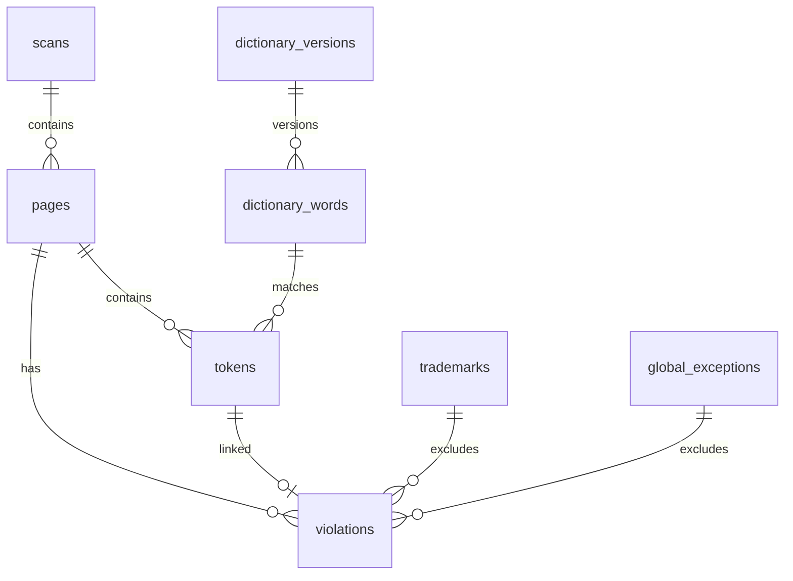
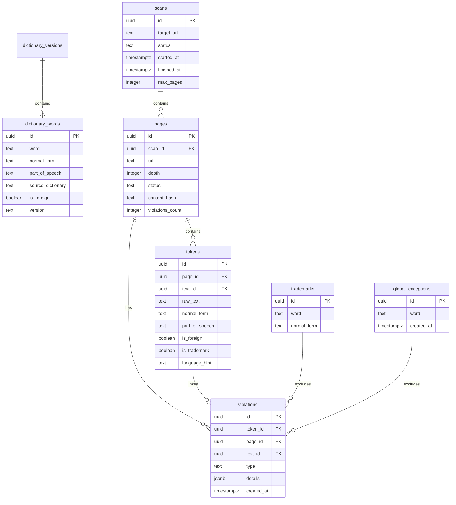

# Data Model Specification: LinguaCheck-RU

**Версия:** 1.7.0  
**СУБД:** PostgreSQL 15+ (Supabase)  
**Дата обновления:** 11 марта 2026

---

## 1. Схема базы данных



---

## 2. Таблицы

### 2.1. `scans`

История сканирований сайтов.

| Колонка | Тип | Nullable | Описание |
|---------|-----|----------|----------|
| `id` | UUID | ❌ PK | Уникальный идентификатор |
| `target_url` | TEXT | ✅ | Целевой URL сканирования |
| `status` | TEXT | ❌ | Статус: `started`, `in_progress`, `completed`, `failed`, `stopped` |
| `started_at` | TIMESTAMPTZ | ❌ | Время начала |
| `finished_at` | TIMESTAMPTZ | ✅ | Время завершения |
| `max_depth` | INTEGER | ❌ | Макс. глубина обхода (1-5) |
| `max_pages` | INTEGER | ❌ | Макс. страниц (до 1000) |

**Индексы:**
```sql
CREATE INDEX idx_scans_status ON scans(status);
CREATE INDEX idx_scans_started_at ON scans(started_at DESC);
```

---

### 2.2. `pages`

Страницы в рамках сканирования.

| Колонка | Тип | Nullable | Описание |
|---------|-----|----------|----------|
| `id` | UUID | ❌ PK | Уникальный идентификатор |
| `scan_id` | UUID | ❌ FK | Ссылка на scans.id |
| `url` | TEXT | ❌ | URL страницы |
| `depth` | INTEGER | ❌ | Глубина вложенности |
| `status` | TEXT | ❌ | `ok`, `timeout`, `blocked` |
| `content_hash` | TEXT | ✅ | Хэш контента (для dedup) |
| `violations_count` | INTEGER | ❌ | Количество нарушений |

**Индексы:**
```sql
CREATE INDEX idx_pages_scan_id ON pages(scan_id);
CREATE INDEX idx_pages_url ON pages(url);
```

---

### 2.3. `tokens`

Токенифицированные слова.

| Колонка | Тип | Nullable | Описание |
|---------|-----|----------|----------|
| `id` | UUID | ❌ PK | Уникальный идентификатор |
| `page_id` | UUID | ✅ FK | Ссылка на pages.id |
| `text_id` | UUID | ✅ FK | Ссылка на текст (для check_text) |
| `raw_text` | TEXT | ❌ | Исходный текст |
| `normal_form` | TEXT | ❌ | Лемма (pymorphy3) |
| `part_of_speech` | TEXT | ❌ | Часть речи |
| `is_foreign` | BOOLEAN | ❌ | Иностранное слово |
| `is_trademark` | BOOLEAN | ❌ | Товарный знак |
| `language_hint` | TEXT | ❌ | `ru`, `en`, `other` |

**Индексы:**
```sql
CREATE INDEX idx_tokens_page_id ON tokens(page_id);
CREATE INDEX idx_tokens_normal_form ON tokens(normal_form);
CREATE INDEX idx_tokens_text_id ON tokens(text_id);
```

---

### 2.4. `violations`

Найденные нарушения.

| Колонка | Тип | Nullable | Описание |
|---------|-----|----------|----------|
| `id` | UUID | ❌ PK | Уникальный идентификатор |
| `token_id` | UUID | ✅ FK | Ссылка на tokens.id |
| `page_id` | UUID | ✅ FK | Ссылка на pages.id |
| `text_id` | UUID | ✅ FK | Ссылка на текст |
| `type` | TEXT | ❌ | Тип нарушения |
| `details` | JSONB | ✅ | Дополнительные данные |
| `created_at` | TIMESTAMPTZ | ❌ | Время создания |

**Типы нарушений:**
- `foreign_word` — Иностранная лексика
- `no_russian_dub` — Отсутствие перевода
- `unrecognized_word` — Опечатка / Не распознано
- `trademark` — Товарный знак
- `possible_trademark` — Потенциальный бренд

**Индексы:**
```sql
CREATE INDEX idx_violations_page_id ON violations(page_id);
CREATE INDEX idx_violations_text_id ON violations(text_id);
CREATE INDEX idx_violations_type ON violations(type);
```

---

### 2.5. `trademarks`

Товарные знаки (исключения).

| Колонка | Тип | Nullable | Описание |
|---------|-----|----------|----------|
| `id` | UUID | ❌ PK | Уникальный идентификатор |
| `word` | TEXT | ❌ | Оригинальное слово |
| `normal_form` | TEXT | ❌ | Нормализованная форма |

**Индексы:**
```sql
CREATE UNIQUE INDEX idx_trademarks_word ON trademarks(word);
CREATE INDEX idx_trademarks_normal_form ON trademarks(normal_form);
```

---

### 2.6. `global_exceptions`

Глобальные исключения.

| Колонка | Тип | Nullable | Описание |
|---------|-----|----------|----------|
| `id` | UUID | ❌ PK | Уникальный идентификатор |
| `word` | TEXT | ❌ | Слово-исключение |
| `created_at` | TIMESTAMPTZ | ❌ | Время добавления |

**Индексы:**
```sql
CREATE UNIQUE INDEX idx_exceptions_word ON global_exceptions(word);
```

---

### 2.7. `dictionary_words`

Словарные статьи.

| Колонка | Тип | Nullable | Описание |
|---------|-----|----------|----------|
| `id` | UUID | ❌ PK | Уникальный идентификатор |
| `word` | TEXT | ❌ | Слово |
| `normal_form` | TEXT | ❌ | Лемма |
| `part_of_speech` | TEXT | ❌ | Часть речи |
| `source_dictionary` | TEXT | ❌ | Источник |
| `is_foreign` | BOOLEAN | ❌ | Иностранное |
| `version` | TEXT | ❌ | Версия словаря |

**Источники:**
- `Orthographic` — Орфографический
- `Orthoepic` — Орфоэпический
- `Explanatory` — Толковый
- `ForeignWords` — Словарь иностранных слов

**Индексы:**
```sql
CREATE INDEX idx_dictionary_words_normal_form ON dictionary_words(normal_form);
CREATE INDEX idx_dictionary_words_source ON dictionary_words(source_dictionary);
```

---

### 2.8. `dictionary_versions`

Версии словарей.

| Колонка | Тип | Nullable | Описание |
|---------|-----|----------|----------|
| `id` | UUID | ❌ PK | Уникальный идентификатор |
| `name` | TEXT | ❌ | Название словаря |
| `version` | TEXT | ❌ | Версия (YYYY-MM-DD) |
| `pdf_path` | TEXT | ✅ | Путь к PDF |
| `processed_at` | TIMESTAMPTZ | ❌ | Время обработки |
| `word_count` | INTEGER | ❌ | Количество слов |

---

## 3. Логика фильтрации

### 3.1. Технический фильтр

**Исключаются из анализа:**
- Email адреса (нормализованные части)
- URL (доменные имена)
- Технические строки (CSS-классы, JS-переменные)

### 3.2. Минимальная длина

**Игнорируются:**
- Одиночные кириллические буквы (кроме предлогов)
- Слова короче 2 символов

### 3.3. Исключения

**Не считаются нарушениями:**
- Слова из `dictionary_words`
- Слова из `trademarks`
- Слова из `global_exceptions`
- Имена собственные (с заглавной буквы, требуют проверки)

---

## 4. Миграции

### Текущая версия: `0005_add_global_exceptions`

**Файлы миграций:**
```
backend/alembic/versions/
├── 0001_initial_schema.py
├── 0002_add_trademarks.py
├── 0003_add_dictionary_versions.py
├── 0004_add_screenshots.py
└── 0005_add_global_exceptions.py
```

**Применение:**
```bash
cd backend
alembic upgrade head
```

---

## 5. ER-диаграмма (полная)



---

## 6. Известные ограничения

- Таблицы созданы в Supabase (PostgreSQL 15)
- Интроспекция через `create_all()` отключена (PgBouncer Transaction Mode)
- Миграции применяются через Alembic
- Скриншоты хранятся в `backend/static/screenshots/`

---

*Документ синхронизирован с кодом 11 марта 2026*
