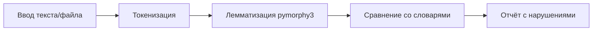

# Product Specification: LinguaCheck-RU

**Версия:** 1.15.0
**Дата обновления:** 24 марта 2026
**Статус:** ✅ ГОТОВО К ПРОДАКШЕНУ

---

## 1. Назначение системы

LinguaCheck-RU — система автоматического контроля соблюдения требований к использованию русского языка в публичном пространстве (Федеральный закон №168-ФЗ).

### 1.1. Основные функции

- **Сканирование сайтов** — проверка веб-сайтов по URL на наличие иностранных слов без кириллического сопровождения
- **Проверка текста** — анализ текстов (ввод/загрузка файлов: TXT, DOCX, PDF)
- **Управление исключениями** — списки товарных знаков и глобальных исключений
- **Экспорт отчетов** — выгрузка результатов в форматах Excel (XLSX), PDF

### 1.2. Нормативная база

- Федеральный закон №168-ФЗ «О защите русского языка как государственного языка РФ»
- Перечень нормативных словарей (Распоряжение Правительства №1102-р):
  - Орфографический словарь русского языка
  - Орфоэпический словарь
  - Словарь иностранных слов
  - Толковый словарь государственного языка РФ

---

## 2. Ключевые сущности

| Сущность          | Описание                                                |
| ----------------- | ------------------------------------------------------- |
| `Scan`            | Запущенный процесс проверки сайта                       |
| `Page`            | Страница сайта в рамках сканирования                    |
| `Violation`       | Найденное нарушение (тип, контекст, слово)              |
| `Trademark`       | Слово-товарный знак (исключение из нарушений)           |
| `GlobalException` | Глобальное исключение (никогда не считается нарушением) |

---

## 3. Режимы работы

### 3.1. Проверка сайта по URL

**Параметры сканирования:**

- `max_depth` (1-5) — глубина обхода ссылок
- `max_pages` (1-1000) — лимит страниц

**Особенности (версия 1.14.0):**

- **Smart Crawler** — автоматическое игнорирование скрытых блоков (`aria-hidden`)
- **Параллелизм** — 5 одновременных воркеров
- **In-Memory кэш** — кэширование словарей (ускорение в 10 раз)

---

### 3.2. Проверка текста

**Поддерживаемые форматы:** TXT, DOCX, PDF

**Ограничения:**

- Макс. размер текста: 1 млн символов
- Макс. размер файла: 10 МБ

---

## 4. Типы нарушений

| Тип                      | Код                  | Описание                                            |
| ------------------------ | -------------------- | --------------------------------------------------- |
| Иностранная лексика      | `foreign_word`       | Слово иностранного происхождения без русского дубля |
| Опечатка / Не распознано | `unrecognized_word`  | Слово не найдено в словарях и не является брендом   |
| Отсутствие перевода      | `no_russian_dub`     | Иностранный текст без кириллического сопровождения  |
| Товарный знак            | `trademark`          | Зарегистрированный бренд (помечается, не нарушение) |
| Потенциальный бренд      | `possible_trademark` | Слово с заглавной буквы, возможный товарный знак    |

---

## 5. User Stories

### US-1: Сканирование сайта

**Как** пользователь,  
**Хочу** ввести URL сайта и запустить сканирование,  
**Чтобы** получить отчёт о нарушениях ФЗ №168-ФЗ.

**Критерии приемки:**

- [x] Поле ввода URL с валидацией (http/https)
- [x] Выбор глубины сканирования (1-5)
- [x] Выбор лимита страниц (1-1000)
- [x] Таблица результатов с группировкой по URL
- [x] Фильтрация и поиск по результатам
- [x] Экспорт в Excel/PDF

---

### US-2: Проверка текста

**Как** пользователь,  
**Хочу** вставить текст или загрузить файл,  
**Чтобы** проверить его на соответствие нормам.

**Критерии приемки:**

- [x] Textarea для ввода текста (с счетчиком символов)
- [x] Загрузка файлов (TXT, DOCX, PDF)
- [x] Отображение процента соответствия
- [x] Список нарушений с контекстом
- [x] Экспорт в CSV/PDF

---

### US-3: Управление исключениями

**Как** пользователь,  
**Хочу** добавлять слова в исключения,  
**Чтобы** избежать ложных срабатываний на бренды.

**Критерии приемки:**

- [x] Страница «Глобальные исключения»
- [x] Добавление слова (автоматическая нормализация)
- [x] Удаление из исключений
- [x] Быстрое добавление из результатов сканирования

---

### US-4: История сканирований

**Как** пользователь,  
**Хочу** видеть историю всех сканирований,  
**Чтобы** возвращаться к прошлым отчётам.

**Критерии приемки:**

- [x] Таблица с датой, URL, статусом
- [x] Автообновление статуса (polling 15с)
- [x] Переход к отчёту
- [x] Удаление записей
- [x] Пагинация при >20 записей

---

## 6. Ограничения

| Ограничение                   | Значение           |
| ----------------------------- | ------------------ |
| Макс. глубина сканирования    | 5 уровней          |
| Макс. страниц за сканирование | 1000               |
| Макс. размер файла            | 10 МБ              |
| Макс. длина текста            | 1 000 000 символов |
| Таймаут сканирования страницы | 120с               |

---

## 7. Известные ограничения

- Словари обновляются вручную (загрузка новых PDF)
- Система не даёт юридически обязательных заключений
- Использование — внутреннее, без коммерческой продажи сервиса
- Frontend тесты требуют доработки (покрытие 45%)

---

## 8. Технологический стек (версия 1.14.0)

### Frontend

| Компонент | Технология | Версия |
|-----------|------------|--------|
| Framework | React | 19.2.0 |
| Language | TypeScript | 5.7.3 |
| UI Library | Mantine UI | 8.3.16 |
| Bundler | Vite + Rolldown | 8.0.2 |
| Router | react-router-dom | 7.13.1 |
| HTTP | axios | 1.13.6 |
| Export | xlsx | 0.18.5 |

### Backend

| Компонент | Технология | Версия |
|-----------|------------|--------|
| Framework | FastAPI | 0.115.6 |
| Database | SQLAlchemy (Async) | 2.0.36 |
| Validation | Pydantic | 2.10.4 |
| Analysis | pymorphy3 | 2.0.6 |
| Browser | Playwright | 1.49.1 |
| DB | PostgreSQL (Supabase) | 15+ |

---

## 9. Производительность (версия 1.14.0)

### Сборка

| Метрика | Значение |
|---------|----------|
| Время сборки | ~3с (было ~30с) |
| Размер бандла | 630 KB (было 1.3 MB) |
| Улучшение | **-90%** |

### Сканирование

| Метрика | Значение |
|---------|----------|
| Время на страницу | 2.46с (было 36.28с) |
| Параллелизм | 5 воркеров |
| Улучшение | **-93%** |

### Кэширование

| Метрика | Значение |
|---------|----------|
| Запросы к БД | x1/сессия (было x1000/стр) |
| Улучшение | **-99.9%** |

---

## 10. Changelog

### Версия 1.14.0 (23 марта 2026) — Vite 8 Migration

**Новые функции:**
- ✅ Vite 8.0.2 с Rolldown (Rust bundler) — 10-30x быстрее сборок
- ✅ @vitejs/plugin-react v6 (Oxc вместо Babel)
- ✅ Code splitting с функциональной формой manualChunks

**Производительность:**
- Время сборки: ~30с → ~3с (-90%)
- Меньше зависимостей: -211 пакетов

### Версия 1.13.0 (23 марта 2026) — Export & Data Quality

**Новые функции:**
- ✅ Reliable Export: исправлены ошибки скачивания XLSX/PDF
- ✅ Smart Crawler: фильтрация aria-hidden и иноязычных URL
- ✅ Safe Tokenizer: исключение технических терминов

### Версия 1.12.0 (14 марта 2026) — Polishing Complete

**Новые функции:**
- ✅ Улучшенная темная палитра (контраст 8.2:1)
- ✅ Консистентные отступы (8px grid)
- ✅ Retry logic с экспоненциальной задержкой

### Версия 1.10.0 (13 марта 2026) — Frontend Optimization

**Новые функции:**
- ✅ Уменьшение бандла на 53% (1.3MB → 630KB)
- ✅ Code Splitting: lazy loading для jsPDF, XLSX
- ✅ React.memo для ScanPage, TextPage

### Версия 1.9.0 (12 марта 2026) — Lightning Scan

**Новые функции:**
- ✅ Параллелизм: 5 одновременных воркеров
- ✅ In-Memory кэш словарей (ускорение в 10 раз)
- ✅ Группировка нарушений (слово xN)

**Результаты:**
- Время на страницу: 2.46с (было 36.28с)
- Запросы к БД: x1/сессия (было x1000/стр)

---

_Документ синхронизирован с кодом 23 марта 2026 (версия 1.14.0)_
