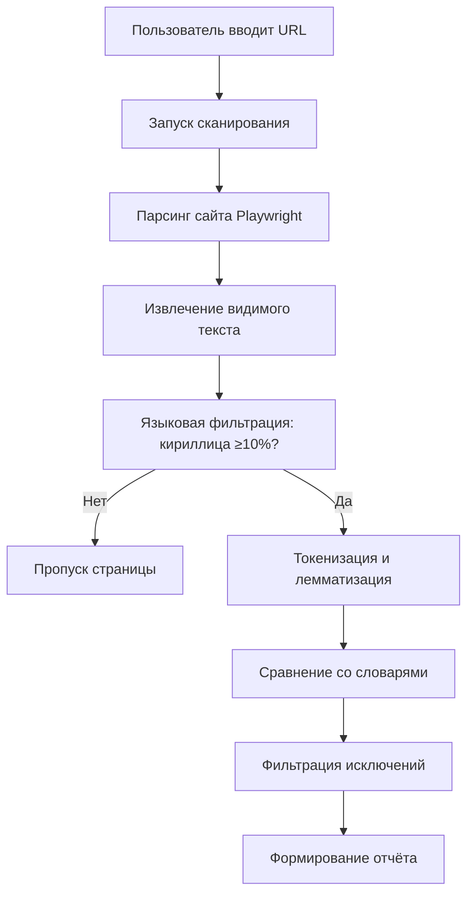
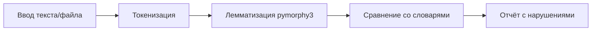

# Product Specification: LinguaCheck-RU

**Версия:** 1.8.0  
**Дата обновления:** 11 марта 2026  
**Статус:** ✅ Актуально

---

## 1. Назначение системы

LinguaCheck-RU — система автоматического контроля соблюдения требований к использованию русского языка в публичном пространстве (Федеральный закон №168-ФЗ).

### 1.1. Основные функции

- **Сканирование сайтов** — проверка веб-сайтов по URL на наличие иностранных слов без кириллического сопровождения
- **Проверка текста** — анализ текстов (ввод/загрузка файлов: TXT, DOCX, PDF)
- **Управление исключениями** — списки товарных знаков и глобальных исключений
- **Экспорт отчетов** — выгрузка результатов в форматах Excel (XLSX), PDF.

### 1.2. Нормативная база

- Федеральный закон №168-ФЗ «О защите русского языка как государственного языка РФ»
- Перечень нормативных словарей (Распоряжение Правительства №1102-р):
  - Орфографический словарь русского языка
  - Орфоэпический словарь
  - Словарь иностранных слов
  - Толковый словарь государственного языка РФ

---

## 2. Ключевые сущности

| Сущность          | Описание                                                |
| ----------------- | ------------------------------------------------------- |
| `Scan`            | Запущенный процесс проверки сайта                       |
| `Page`            | Страница сайта в рамках сканирования                    |
| `Violation`       | Найденное нарушение (тип, контекст, слово)              |
| `Trademark`       | Слово-товарный знак (исключение из нарушений)           |
| `GlobalException` | Глобальное исключение (никогда не считается нарушением) |

---

## 3. Режимы работы

### 3.1. Проверка сайта по URL

**Параметры сканирования:**

- `max_depth` (1-5) — глубина обхода ссылок

### 3.2. Проверка текста

**Поддерживаемые форматы:** TXT, DOCX, PDF

---

## 4. Типы нарушений

| Тип                      | Код                  | Описание                                            |
| ------------------------ | -------------------- | --------------------------------------------------- |
| Иностранная лексика      | `foreign_word`       | Слово иностранного происхождения без русского дубля |
| Опечатка / Не распознано | `unrecognized_word`  | Слово не найдено в словарях и не является брендом   |
| Отсутствие перевода      | `no_russian_dub`     | Иностранный текст без кириллического сопровождения  |
| Товарный знак            | `trademark`          | Зарегистрированный бренд (помечается, не нарушение) |
| Потенциальный бренд      | `possible_trademark` | Слово с заглавной буквы, возможный товарный знак    |

---

## 5. User Stories

### US-1: Сканирование сайта

**Как** пользователь,  
**Хочу** ввести URL сайта и запустить сканирование,  
**Чтобы** получить отчёт о нарушениях ФЗ №168-ФЗ.

**Критерии приемки:**

- [ ] Поле ввода URL с валидацией (http/https)
- [ ] Выбор глубины сканирования (1-5)
- [ ] Выбор лимита страниц (1-1000)
- [ ] Таблица результатов с группировкой по URL
- [ ] Фильтрация и поиск по результатам
- [ ] Экспорт в Excel/PDF

### US-2: Проверка текста

**Как** пользователь,  
**Хочу** вставить текст или загрузить файл,  
**Чтобы** проверить его на соответствие нормам.

**Критерии приемки:**

- [ ] Textarea для ввода текста (с счетчиком символов)
- [ ] Загрузка файлов (TXT, DOCX, PDF)
- [ ] Отображение процента соответствия
- [ ] Список нарушений с контекстом
- [ ] Экспорт в CSV/PDF

### US-3: Управление исключениями

**Как** пользователь,  
**Хочу** добавлять слова в исключения,  
**Чтобы** избежать ложных срабатываний на бренды.

**Критерии приемки:**

- [ ] Страница «Глобальные исключения»
- [ ] Добавление слова (автоматическая нормализация)
- [ ] Удаление из исключений
- [ ] Быстрое добавление из результатов сканирования

### US-4: История сканирований

**Как** пользователь,  
**Хочу** видеть историю всех сканирований,  
**Чтобы** возвращаться к прошлым отчётам.

**Критерии приемки:**

- [ ] Таблица с датой, URL, статусом
- [ ] Автообновление статуса (polling 15с)
- [ ] Переход к отчёту
- [ ] Удаление записей
- [ ] Пагинация при >20 записей

---

## 6. Ограничения

| Ограничение                   | Значение           |
| ----------------------------- | ------------------ |
| Макс. глубина сканирования    | 5 уровней          |
| Макс. страниц за сканирование | 1000               |
| Макс. размер файла            | 10 МБ              |
| Макс. длина текста            | 1 000 000 символов |
| Таймаут сканирования страницы | 120с               |

---

## 7. Известные ограничения

- Словари обновляются вручную (загрузка новых PDF)
- Система не даёт юридически обязательных заключений
- Использование — внутреннее, без коммерческой продажи сервиса
- Визуальное доминирование (`visual_dominance`) удалено из frontend (осталось в backend)

---

## 8. Changelog

### Версия 1.8.0 (11 марта 2026)

**Добавлено:**
- ✅ Дедупликация нарушений: 1 нарушение на 1 слово на 1 страницу.
- ✅ Чанкирование (chunking) запросов к БД для загрузки больших отчетов (до 100к записей).
- ✅ Поле «Лимит страниц» в интерфейсе (до 1000 страниц).
- ✅ Исправлена фильтрация по типу нарушения в UI.

### Версия 1.7.0 (9 марта 2026)

**Удалено:**

- ❌ Полностью удален функционал скриншотов.
- ❌ Параметр `capture_screenshots` из API.

**Добавлено:**

- ✅ Единый CLI-инструмент `manage.py`.
- ✅ SEO-модуль `react-helmet-async`.
- ✅ Сворачиваемый сайдбар.

### Версия 1.6.0 (9 марта 2026)

**Удалено:**

- ❌ Тип нарушения «Визуальное доминирование» из frontend
- ❌ Колонка «Вес (%)» из таблицы нарушений
- ❌ Кнопка «Все в бренды»
- ❌ Модальное окно «Бренды»

**Добавлено:**

- ✅ Кнопка «Пометить как исключение» (добавление в global_exceptions)
- ✅ Tooltip для всех кнопок действий (Mantine UI)
- ✅ Tooltip для поля «Глубина» и URL
- ✅ Счетчик символов в TextPage

**Исправлено:**

- 🐛 Горизонтальный скролл таблицы на мобильных
- 🐛 Недостаточный размер touch-целей (<44px)
- 🐛 Контраст dimmed текста (WCAG AA)
- 🐛 Пагинация в HistoryPage (зависание при 0 записей)
- 🐛 Backend: NameError при импорте exceptions router
- 🐛 Frontend: Vite слушал только IPv6

**UX улучшения:**

- ♿ ARIA-labels для всех интерактивных иконок
- 📱 Адаптивный padding на мобильных
- ⏱ Reduced-motion поддержка

---

_Документ синхронизирован с кодом 11 марта 2026_
